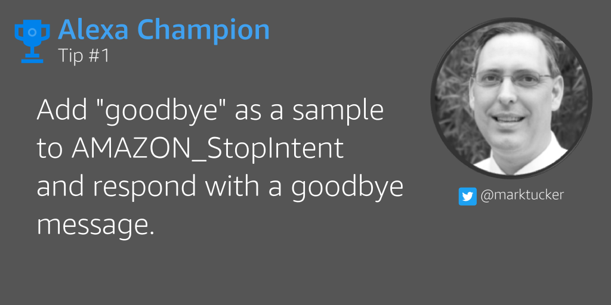
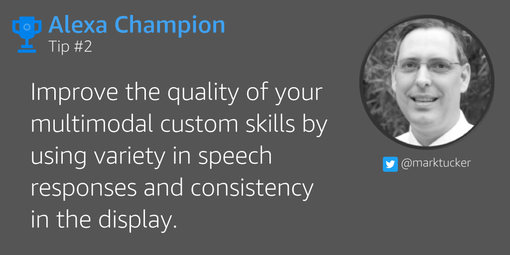
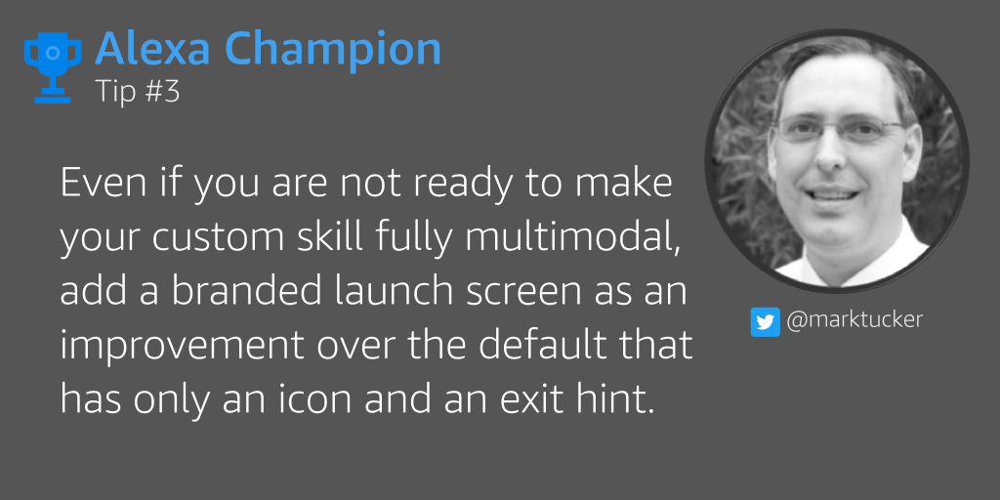
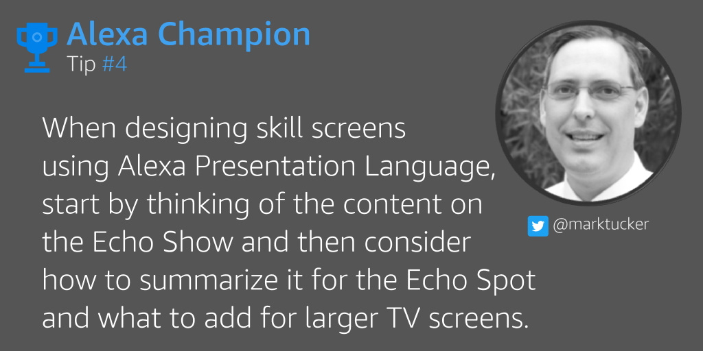
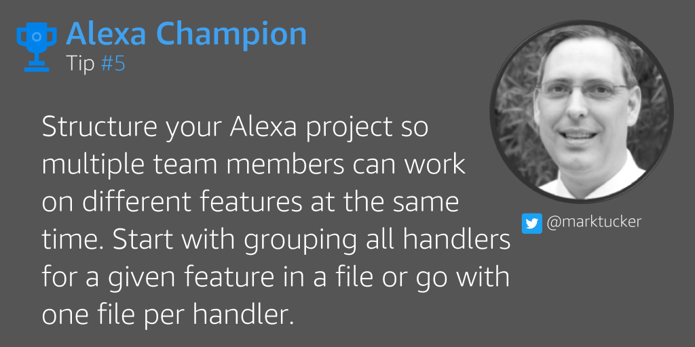
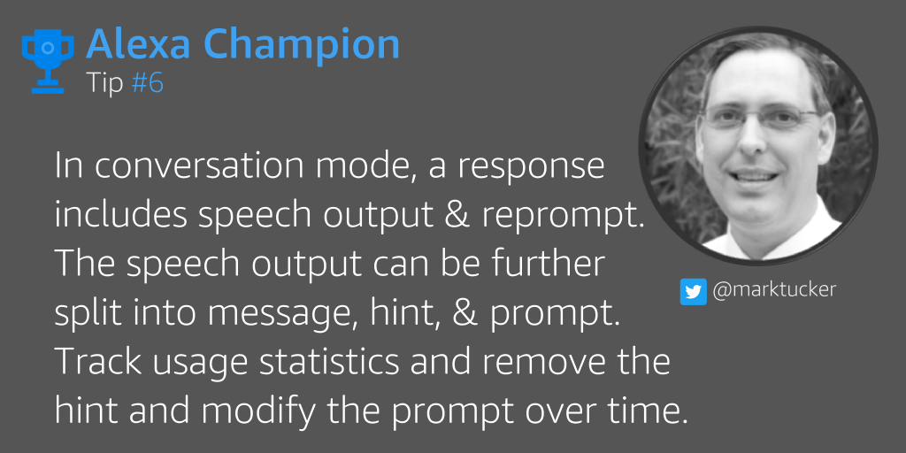
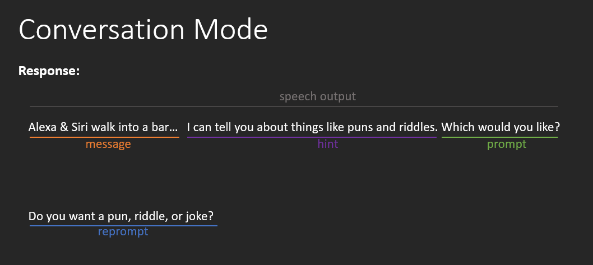
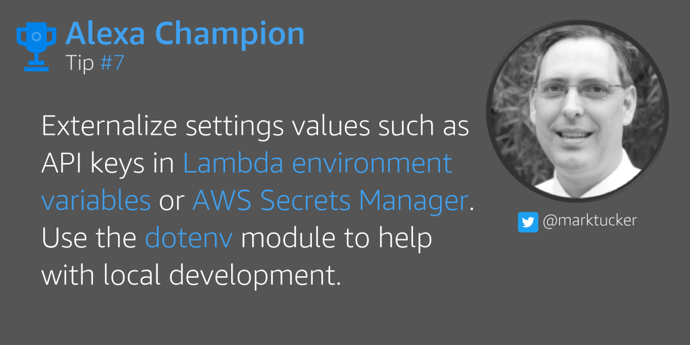
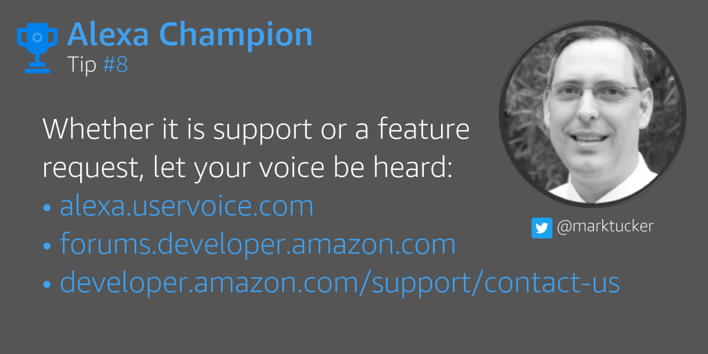

# Alexa Champion Tips
Copyright 2018 by Mark Tucker. All rights reserved. 
[@marktucker](https://twitter.com/marktucker)

## Tip 1 - Say Goodbye
[sample](https://gist.github.com/rmtuckerphx/4c5b4ef78c7fd52ea05109418876b96f)

## Tip 2 - Response Variety

## Tip 3 - Launch Screen

## Tip 4 - Screen Layout

## Tip 5 - Team Project Structure

## Tip 6 - Vary Hint & Prompt

## Tip 7 - Externalize Settings

## Tip 8 - Speak Up

Support
- [developer.amazon.com/support/contact-us](https://developer.amazon.com/support/contact-us)
- [forums.developer.amazon.com](https://forums.developer.amazon.com)

Feature Request
- [alexa.uservoice.com](https://alexa.uservoice.com)
